---
#Front matter (metadata).
abstract:               # REQUIRED

authors:
 - name: "Manoj Jahgirdar"
   email: "manoj.jahgirdar@in.ibm.com"
 - name: "Rahul Reddy Ravipally"
   email: "raravi86@in.ibm.com"
 - name: "Srikanth Manne"
   email: "srikanth.manne@in.ibm.com"
 - name: "Manjula G. Hosurmath"
   email: "mhosurma@in.ibm.com"

completed_date: 2020-01-20

components:
- slug: "cockroachdb"
  name: "CockroachDB"
  url: "https://marketplace.redhat.com/en-us/products/cockroachdb-operator"
  type: "component"
- slug: "redhat-marketplace"
  name: "Red Hat Marketplace"
  url: "https://marketplace.redhat.com/"
  type: "component"

draft: true|false       # REQUIRED

excerpt:                # REQUIRED

keywords:               # REQUIRED - comma separated list

last_updated:           # REQUIRED - Note: date format is YYYY-MM-DD

primary_tag: "databases"

pta:                    # REQUIRED - Note: can be only one
# For a full list of options see https://github.ibm.com/IBMCode/Definitions/blob/master/primary-technology-area.yml
# Use the "slug" value found at the link above to include it in this content.
# Example (remove the # to uncomment):
 # - "cloud, container, and infrastructure"

pwg:                    # REQUIRED - Note: can be one or many
# For a full list of options see https://github.ibm.com/IBMCode/Definitions/blob/master/portfolio-working-group.yml
# Use the "slug" value found at the link above to include it in this content.
# Example (remove the # to uncomment):
# - "containers"

related_content:        # OPTIONAL - Note: zero or more related content
  - type: announcements|articles|blogs|patterns|series|tutorials|videos
    slug:

related_links:           # OPTIONAL - Note: zero or more related links
  - title:
    url:
    description:

runtimes:               # OPTIONAL - Note: Select runtimes from the complete set of runtimes below. Do not create new runtimes. Only use runtimes specifically in use by your content.
# For a full list of options see https://github.ibm.com/IBMCode/Definitions/blob/master/runtimes.yml
# Use the "slug" value found at the link above to include it in this content.
# Example (remove the # to uncomment):
 # - "asp.net 5"

services:               # OPTIONAL - Note: please select services from the complete set of services below. Do not create new services. Only use services specifically in use by your content.
# For a full list of options see https://github.ibm.com/IBMCode/Definitions/blob/master/services.yml
# Use the "slug" value found at the link above to include it in this content.
# Example (remove the # to uncomment):
# - "blockchain"

subtitle:               # REQUIRED

tags:
# Please select tags from the complete set of tags below. Do not create new tags. Only use tags specifically targeted for your content. If your content could match all tags (for example cloud, hybrid, and on-prem) then do not tag it with those tags. Less is more.
# For a full list of options see https://github.ibm.com/IBMCode/Definitions/blob/master/tags.yml
# Use the "slug" value found at the link above to include it in this content.
# Example (remove the # to uncomment):
 # - "blockchain"

title: Get started using a CockroachDB operator hosted on Red Hat Marketplace
meta_title: Deploy a CockroachDB operator to an OpenShift cluster
subtitle: Deploy a Cockraoch DB operator to an OpenShift cluster 

translators:             # OPTIONAL - Note: can be one or more
  - name:
    email:

type: tutorial

---

Red Hat® OpenShift® 4 users can use [Red Hat Marketplace](https://marketplace.redhat.com/en-us/about) to access certified software for container-based environments. Software in the marketplace is immediately available to deploy on any Red Hat OpenShift cluster, in a fast, integrated way. In this tutorial, in this tutorial, we show you how to get up running with CockroachDB hosted on Red Hat Marketplace. CockroachDB is an elastic SQL database that easily scales transactions for your apps and services.

## Prerequisites

* Red Hat OpenShift version 4.3 is requried to use with the software in Red Hat Markeplace. You can set up a class cluster on IBM Cloud using these instructions: 
[Set up OpenShift Cluster](https://cloud.ibm.com/docs/openshift?topic=openshift-getting-started).
* [Create an account](https://marketplace.redhat.com/api-security/en-us/login/landing) on Red Hat Marketplace.

## Steps

To get up and running with CockroachDB hosted on Red Hat Marketplace you will:

1. [Configure a Red Hat OpenShift cluster with Red Hat Marketplace by:](#1-configure-a-red-hat-openhift-cluster-with-red-hat-marketplace)
    * Downloading an OpenShift command line interface (CLI) binary
    * Registering the cluster on Red Hat Marketplace
    * Creating a project in the Red Hat Marketplace web console
1. [Connect to the Openshift Cluster in your CLI](#2-connect-to-the-openshift-cluster-in-your-cli)
1. [Deploy a CockroachDB Operator on an OpenShift cluster](#3-deploy-a-cockroachdb-operator-on-an-openshift-cluster)
1. [Create a database instance](#4-create-a-database-instance)

## 1. Configure a Red Hat OpenShift cluster with Red Hat Marketplace

To configure a Red Hat OpenShift cluster with Red Hat Marketplace, you need to download the OpenShift CLI binary, register the cluster on Red Hat Marketplace, and create a project in the Red Hat Marketplace console.

### Download an OpenShift command line interface (CLI) binary

To launch the cluster console &mdash; also called Red Hat OpenShift Container Platform &mdash; follow these steps:

1. Log in to your [IBM Cloud Account](https://cloud.ibm.com/) and navigate to the dashboard.

    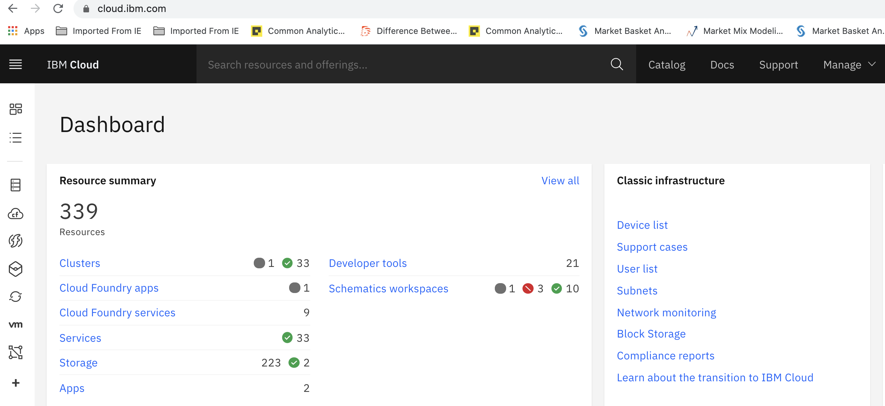

1. Click **Clusters** and select the cluster you created in the prerequisites. In this case, the cluster name is `cp-rhm-poc`.

    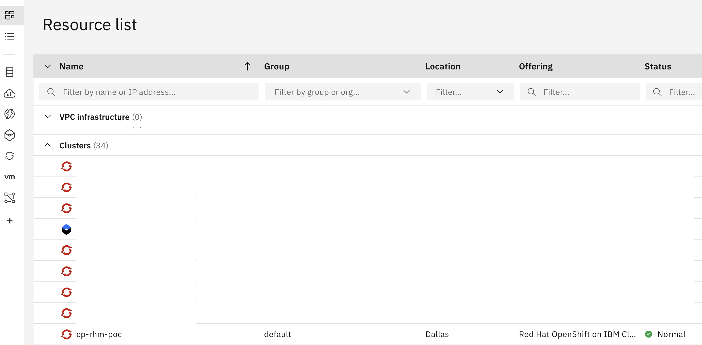

1. After you launch the cluster, click on **OpenShift web console** on the top right-hand side of your screen.

    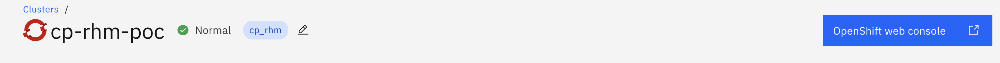

1. From the Red Hat OpenShift Container Platform web console, select the **question mark icon** on the top right-hand side and select **Command Line Tools**. 

    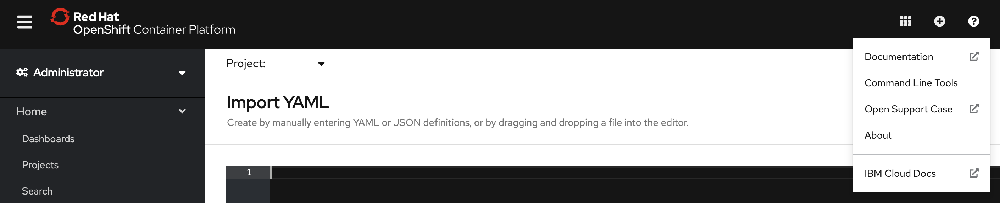

1. Navigate to the section `oc - OpenShift Command Line Interface (CLI)` and download the respective oc binary onto your local system. 

    **Note: You need this binary to manage OpenShift projects from a terminal and to natively support OpenShift Container Platform features.**

    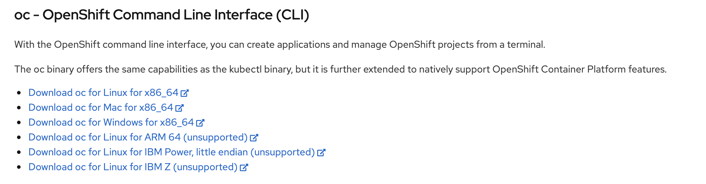

Now you are ready to register the OpenShift cluster on Red Hat Marketplace. This step is mandatory to install any operators from Red Hat Marketplace platform using the OpenShift cluster.

### Register the cluster on Red Hat Marketplace

1. Log in to the [Red Hat Marketplace](https://marketplace.redhat.com/en-us). Select a workspace and click **Cluster**. You need to add the new OpenShift cluster and register it on the Red Hat Marketplace platform.

    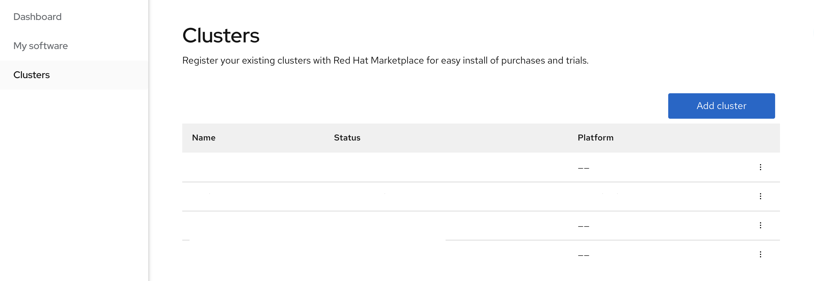

1. Update the cluster name, follow prompts to generate a pull secret, and save it.

    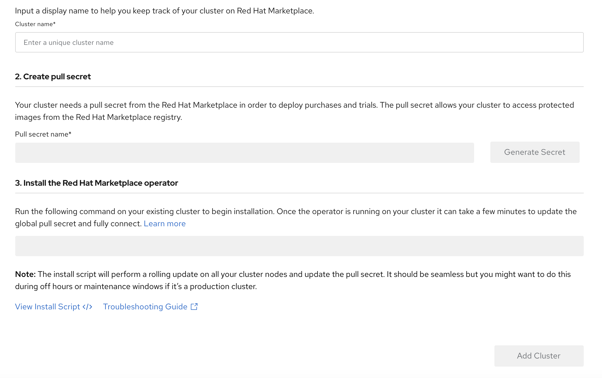

1. In the GUI, copy the curl command which starts with `curl -sL https` and append the pull secret towards the end. The entire script should be handy to be used in next step.

1. You need to start the cluster first to register it. Open a terminal and type `oc login`, update the username and password which are used for accessing the cluster. Press **Enter**.

    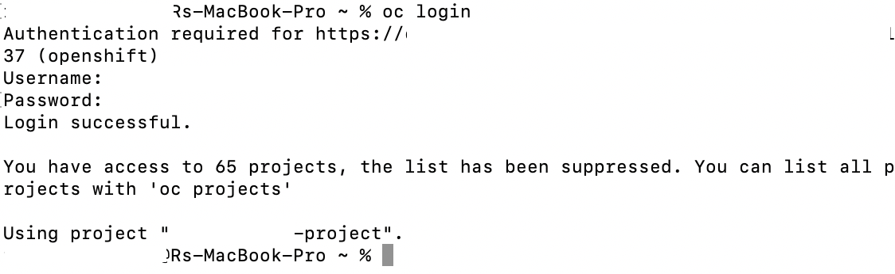

- Your cluster should be up and running at this point. You need to run the entire script from the previous step and hit `Enter`. It will take a couple of minutes to see that you have successfully registered the cluster on the Red Hat Marketplace portal.

    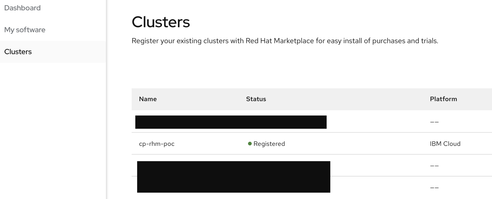

### Create a project in the Red Hat Marketplace web console

To create a project that you can use and manage from the command line, go to the Red Hat Marketplace web console and click **Create Project**. Name the project: `Cockroachdb-test-project`.

    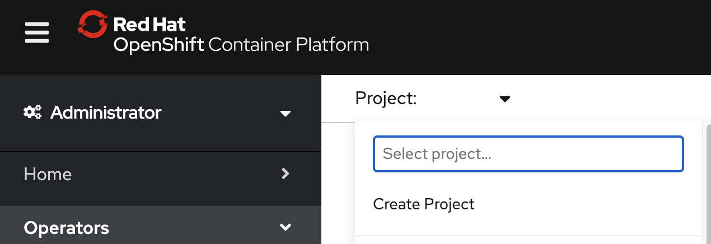

## 2. Connect to the Openshift Cluster in your CLI

1. Log in to the ROKS (IBM Managed) Openshift<!--EM: What's the actual product name you're referecing here? We can't use the ROKS acronym--> cluster through your CLI. To log in, you need a token which can be genrated after you log in to Openshift Cluster web console. See below screenshot to `copy the path`. <--EM: We can't tell people to copy the path b/c not all our readers will be able to see the image. For accessibility reasons, will you explain what the reader is supposed to do exactly?-->

    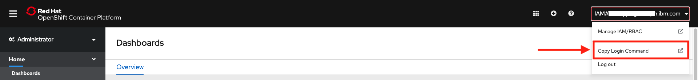

1. A new window will open requesting the login token details. See below screenshot for details. Copy the login token as per the below screenshot. <!--EM: Again, we have to describe the steps and not rely on the images to tell readers what to do.-->

    

1. In your terminal, paste the login command<!--EM: What command is that?? Will readers know?-->. Once you login, you should see a screen that has information about your login name, your server, the token, and the projects. <!--EM: I'm not sure if we need the image below since so much is whited out. Do you think it's necessary? If so, we need to describe it-->.

    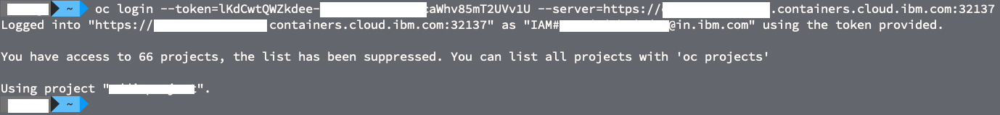

## 3. Deploy a CockroachDB Operator on an OpenShift cluster

Now that you have your clusters set up, the following steps show you how to dpeploy a CockroachDB operator on an OpenShift cluster.

1. Go to the [Red Hat Marketplace catalog](https://marketplace.redhat.com/en-us) and search for CockroachDB. Select `CockroachDB` from the results.

1. The CockroachDB product page gives you an overview, documentation, and pricing options associated with the product. Select the `Free Trial` button.

    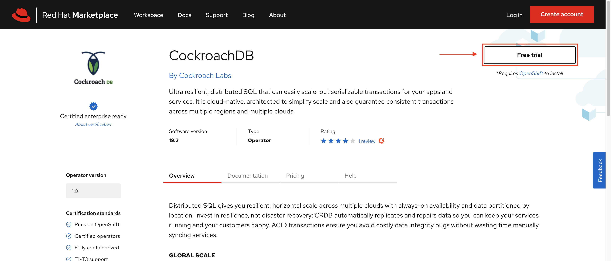

1. Next, the purchase summary will show the Subscription term, with a total cost of $0.00. Click **Start trial**.

    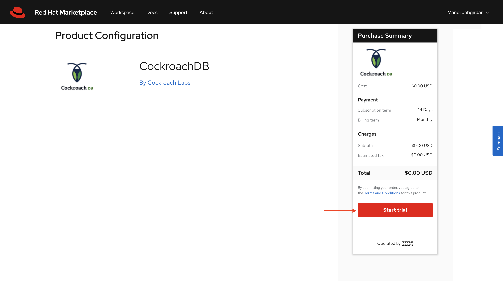

    > You can visit [Workspace > My Software](https://marketplace.redhat.com/en-us/workspace/software) to view your list of purchased softwares.

1. In the Red Hat Marketplace dashbaord, select the CockroachDB tile, and then click the **Operators tab**. Select the **Install Operator** button. Leave the default selection for Update channel and Approval strategy. Select the cluster and namespace scope as `cockroachdb-test` for the operator and click **Install**. <!--EM: The following image is super blurry. Do you have another one?-->

    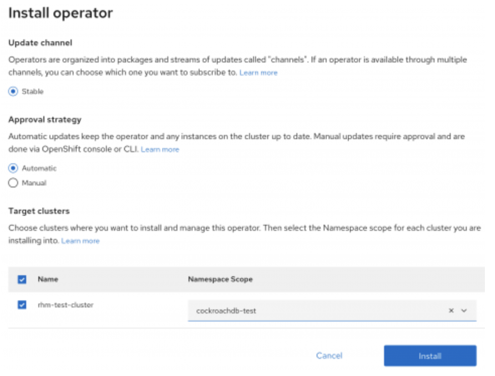

1. You should see a message that indicates the install process initiated in the cluster.

<!--EM: deleted that image b/c it was blurry but didn't add value-->

## 4. Create a database instance

1. Log in to your OpenShift cluster. From the left navigation, click **Operators** and select **Installed Operators** to confirm the installation was successful. You should see the `CockroachDB` operator listed under the `cockroachdb-test` project.

    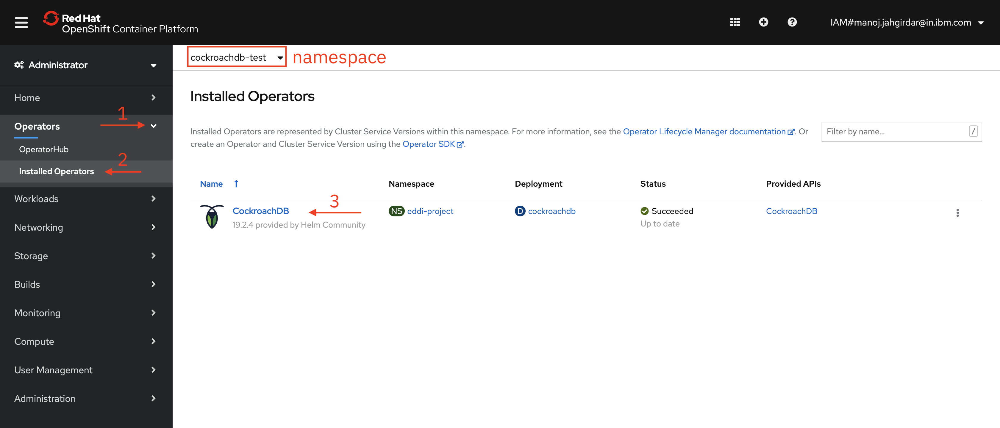

1. On the CockroachDB operator screen, look under Provided APIs and click on **Create Instance**.

    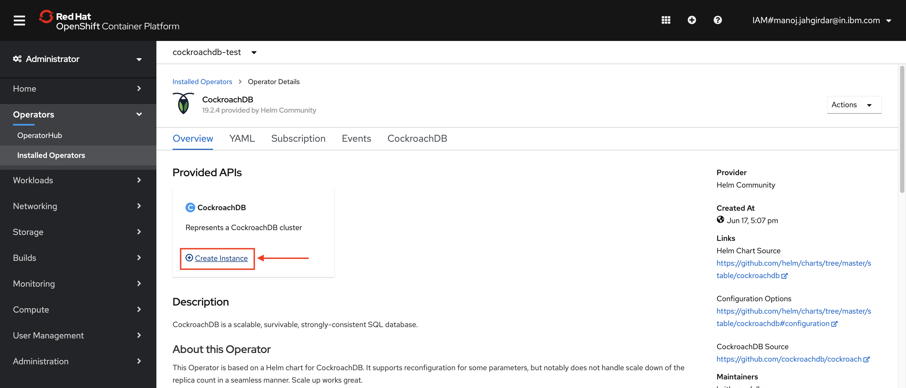

1. The Create Cockroachdb page displays with the default YAML. Do not edit anything in the YAML file; just click the **Create** button.

    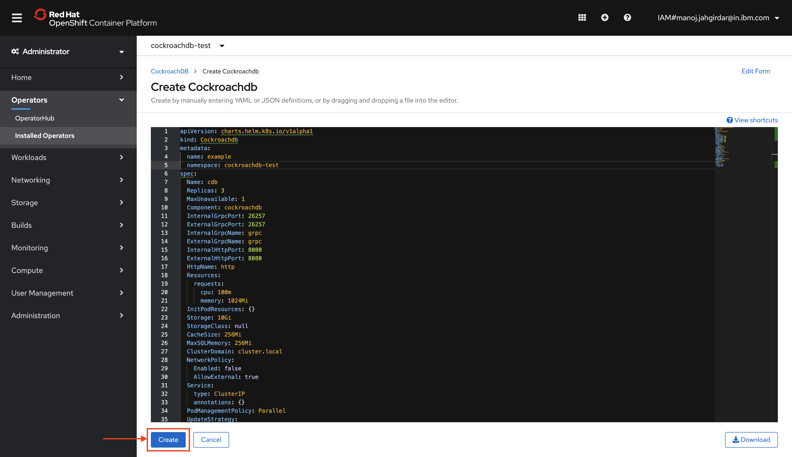

    CockroachDB pods should come up when the database installation is completed. 

1. Run the following command in your terminal to check the status:

    ```bash
    $ oc project cockroachdb-test
    ```

    You should get a result similar to the following:

     ```bash
    Now using project "cockroachdb-test" on server "https://c107-e.us-south.containers.cloud.ibm.com:32137".
    ```

1. At this point, the database pods are deployed, UP and running. To check the pods run the following command:

    ```bash
    $ kubectl get pods
    ```

    ```bash
    NAME                                               READY   STATUS      RESTARTS   AGE
    cockroachdb-6867d47bc5-l44zs                       1/1     Running     0          12d
    example-cockroachdb-0                              1/1     Running     3          3d21h
    example-cockroachdb-1                              1/1     Running     1          12d
    example-cockroachdb-2                              1/1     Running     3          12d
    example-cockroachdb-init-nzvx8                     0/1     Completed   0          12d
    ```
