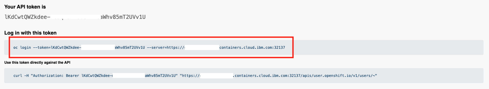

---
#Front matter (metadata).
abstract:               # REQUIRED

authors:
 - name: "Manoj Jahgirdar"
   email: "manoj.jahgirdar@in.ibm.com"
 - name: "Rahul Reddy Ravipally"
   email: "raravi86@in.ibm.com"
 - name: "Srikanth Manne"
   email: "srikanth.manne@in.ibm.com"
 - name: "Manjula G. Hosurmath"
   email: "mhosurma@in.ibm.com"

completed_date: 2020-01-20

components:
- slug: "cockroachdb"
  name: "CockroachDB"
  url: "https://marketplace.redhat.com/en-us/products/cockroachdb-operator"
  type: "component"
- slug: "redhat-marketplace"
  name: "Red Hat Marketplace"
  url: "https://marketplace.redhat.com/"
  type: "component"

draft: true|false       # REQUIRED

excerpt:                # REQUIRED

keywords:               # REQUIRED - comma separated list

last_updated:           # REQUIRED - Note: date format is YYYY-MM-DD

primary_tag:          # REQUIRED - Note: Choose only only one primary tag. Multiple primary tags will result in automation failure. Additional non-primary tags can be added below.

pta:                    # REQUIRED - Note: can be only one
# For a full list of options see https://github.ibm.com/IBMCode/Definitions/blob/master/primary-technology-area.yml
# Use the "slug" value found at the link above to include it in this content.
# Example (remove the # to uncomment):
 # - "cloud, container, and infrastructure"

pwg:                    # REQUIRED - Note: can be one or many
# For a full list of options see https://github.ibm.com/IBMCode/Definitions/blob/master/portfolio-working-group.yml
# Use the "slug" value found at the link above to include it in this content.
# Example (remove the # to uncomment):
# - "containers"

related_content:        # OPTIONAL - Note: zero or more related content
  - type: announcements|articles|blogs|patterns|series|tutorials|videos
    slug:

related_links:           # OPTIONAL - Note: zero or more related links
  - title:
    url:
    description:

runtimes:               # OPTIONAL - Note: Select runtimes from the complete set of runtimes below. Do not create new runtimes. Only use runtimes specifically in use by your content.
# For a full list of options see https://github.ibm.com/IBMCode/Definitions/blob/master/runtimes.yml
# Use the "slug" value found at the link above to include it in this content.
# Example (remove the # to uncomment):
 # - "asp.net 5"

series:                 # OPTIONAL
 - type:
   slug:

services:               # OPTIONAL - Note: please select services from the complete set of services below. Do not create new services. Only use services specifically in use by your content.
# For a full list of options see https://github.ibm.com/IBMCode/Definitions/blob/master/services.yml
# Use the "slug" value found at the link above to include it in this content.
# Example (remove the # to uncomment):
# - "blockchain"

subtitle:               # REQUIRED

tags:
# Please select tags from the complete set of tags below. Do not create new tags. Only use tags specifically targeted for your content. If your content could match all tags (for example cloud, hybrid, and on-prem) then do not tag it with those tags. Less is more.
# For a full list of options see https://github.ibm.com/IBMCode/Definitions/blob/master/tags.yml
# Use the "slug" value found at the link above to include it in this content.
# Example (remove the # to uncomment):
 # - "blockchain"

title:                  # REQUIRED

translators:             # OPTIONAL - Note: can be one or more
  - name:
    email:

type: tutorial

---

# Steps to Deploy CockroachDB Operator from Red Hat Marketplace on OpenShift Cluster

### Step 1: Configure Openshift Cluster(ROKS) with Red Hat Marketplace

#### Step 1.1: Download OpenShift Command Line Interface (CLI) binary

- Follow the steps below to launch the cluster console which is also called RedHat OpenShift Container Platform.

- Login to [IBM Cloud Account](https://cloud.ibm.com/) and navigate to Dashboard as shown.


- Click on **Clusters** and select the cluster which you have created under prerequisites. In our case, cluster name is **cp-rhm-poc**.


- After you launch the cluster, click on **OpenShift web console** on the top right hand side.


- We can see the RedHat OpenShift Container Platform (Web Console). Click on **question mark icon** on the top right hand side and select **Command Line Tools**. 


- Navigate to the section `oc - OpenShift Command Line Interface (CLI)` and download the respective oc binary onto your local system. 

**NOTE: This is needed to manage OpenShift projects from a terminal and is further extended to natively support OpenShift Container Platform features.**


- We are all set to proceed to next step which is to register the OpenShift cluster on RedHat Marketplace platform. 

**NOTE: This is mandatory to install any operators from RedHat Marketplace platform using the OpenShift cluster**.

#### Step 1.2: Register the cluster on RedHat Marketplace

- Sign up and login to RHM portal at [Link](https://marketplace.redhat.com/en-us) and click on **workspace** and then click on cluster. We need to add our new OpenShift cluster and register it on RHM platform.


- Update the **cluster name**, generate the pull secret as per the instructions and save it as shown.


- Copy the curl command which starts with `curl -sL https` and append the pull secret towards the end. 

**NOTE: The entire script should be handy to be used in next step.**

- We need to start the cluster first to register it. Open a terminal and type `oc login`, update the `username` and `password` which are used for accessing the cluster and hit enter. 


- The cluster is up and running at this point. We need to run the entire script which is from previous step and hit enter. It will take a couple of mins and we can see that we have successfully registered the cluster on RHM portal.


#### Step 1.3: Create a project in web console

- We need to create a project to be used and managed from command line. Click on **Create Project** and give a name as `Cockroachdb-test-project`.


### Step 2: Connect to the Openshift Cluster in CLI (Command Line Interface)

- Login to the ROKS(IBM Managed) Openshift cluster through CLI(command line Iterface). 
To login you would require token which can be genrated after you login to Openshift Cluster web console. See below screenshot to `copy the path`.


- A new window will open with the login token details. See below screenshot for details. Copy the login token as per the below screenshot.


- In terminal, paste the login command, Once you login you would see a similar screen as shown below.


### Step 3: Deploy CockroachDB Operator on OpenShift cluster

- CockroachDB is a cloud-native database—scalable, distributed SQL for Kubernetes. It is a great choice for OpenShift because it offers the familiarity and power of SQL with the comfort of your existing ORMs—and automated sharding ensures great performance as you scale your applications.

- Go to the [Marketplace catalog](https://marketplace.redhat.com/en-us) and search for CockroachDB. Select `CockroachDB` from the results as shown.


- The CockroachDB product page gives you an overview, documentation, and pricing options associated with the product. Click on the `Free Trial` button as shown.


- Next, the purchase summary will show the `Subscription term` and total cost is $0.00. Click `Start trial` as shown.


> You can visit [Workspace > My Software](https://marketplace.redhat.com/en-us/workspace/software) to view your list of purchased softwares.

- Back in the **web dashboard**, select the **CockroachDB tile** and then select the **Operators tab**. Click on the `Install Operator` button. Leave the default selection for **Update channel** and **Approval strategy**. Select the cluster and namespace scope as `cockroachdb-test` for the operator and click `Install`.


- A message as shown below appears at the top of your screen indicating the install process initiated in the cluster.


### Step 4: Create a database instance

- Log into your **OpenShift cluster** and look under `Operators > Installed Operators` to confirm the installation was successful.

- The operator `CockroachDB` should list under the project/namespace `cockroachdb-test` as shown.


- Click on `CockroachDB` operator, under **Provided API's**, click on `Create Instance` as shown.


- The **Create Cockroachdb** page will be displayed with the default YAML, do not edit anything in the YAML file, just click on the `Create` button as shown.


- CockroachDB pods should come up when the database installation is completed. 

- Run the following command in terminal to check the status:

```bash
$ oc project cockroachdb-test
```

- You should get a result similar to the following:

```bash
Now using project "cockroachdb-test" on server "https://c107-e.us-south.containers.cloud.ibm.com:32137".
```

- At this point, the database pods are deployed, UP and running. To check the pods run the following command:

```bash
$ kubectl get pods
```

```bash
NAME                                               READY   STATUS      RESTARTS   AGE
cockroachdb-6867d47bc5-l44zs                       1/1     Running     0          12d
example-cockroachdb-0                              1/1     Running     3          3d21h
example-cockroachdb-1                              1/1     Running     1          12d
example-cockroachdb-2                              1/1     Running     3          12d
example-cockroachdb-init-nzvx8                     0/1     Completed   0          12d
```
